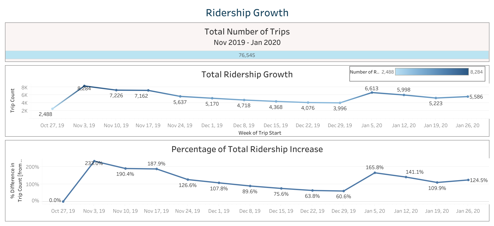
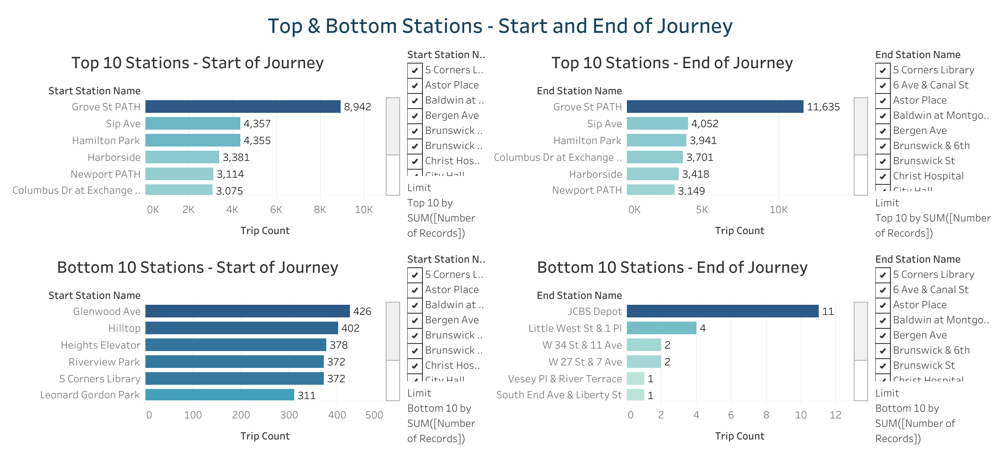
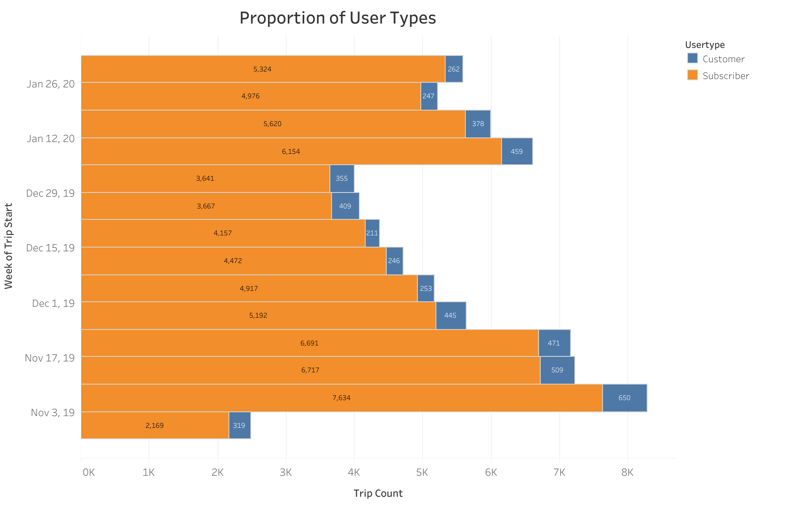
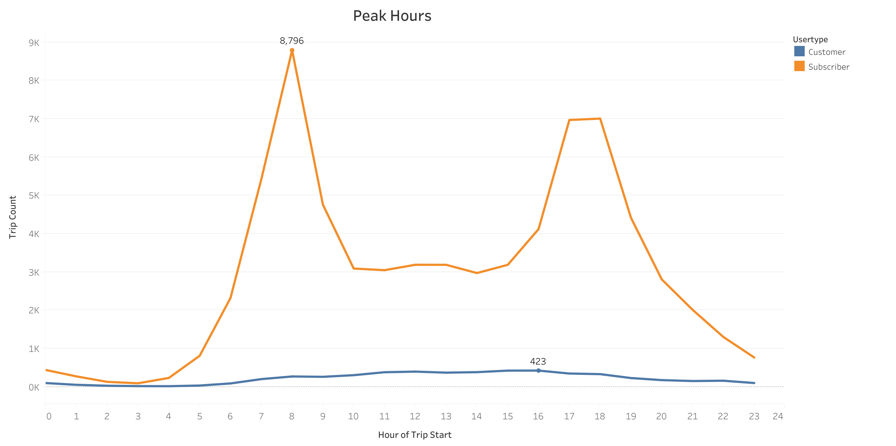
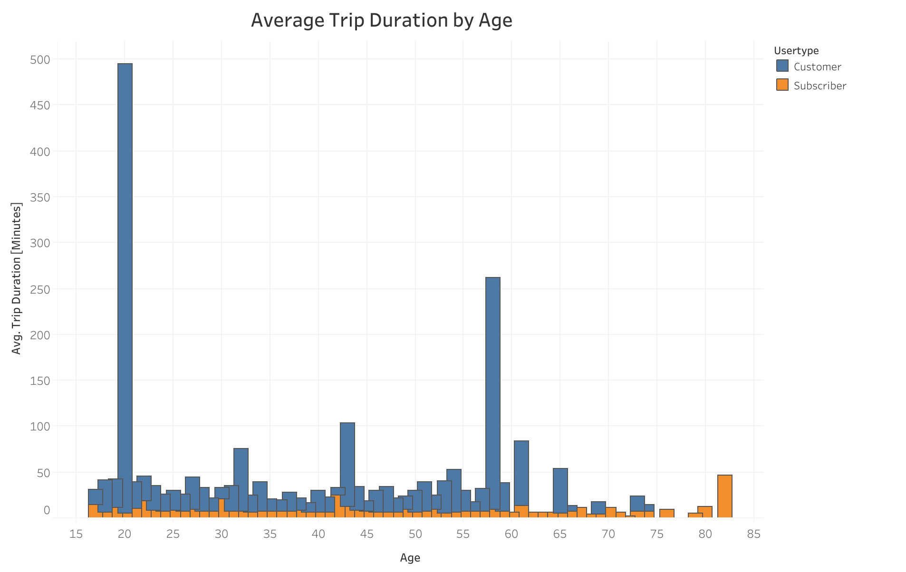
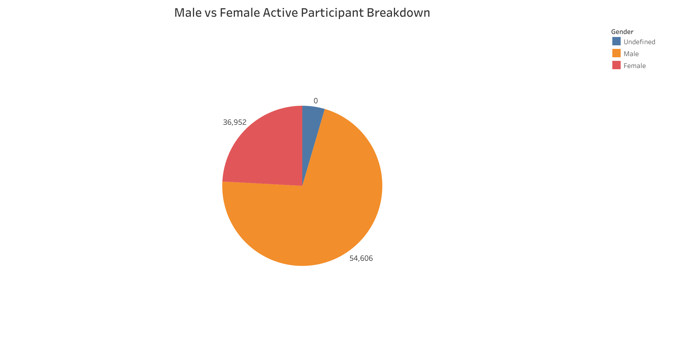
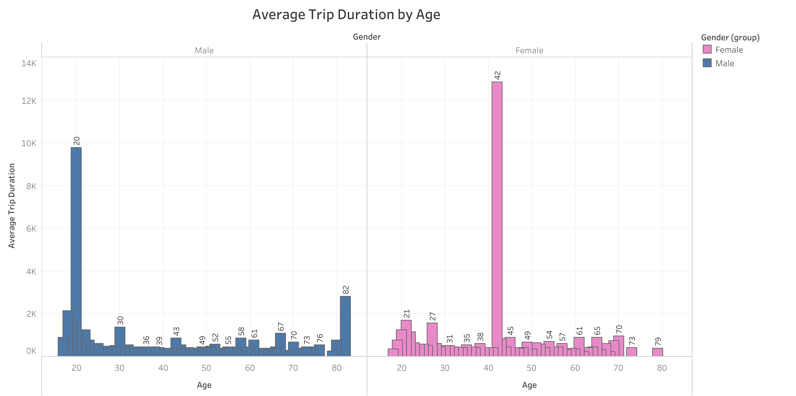
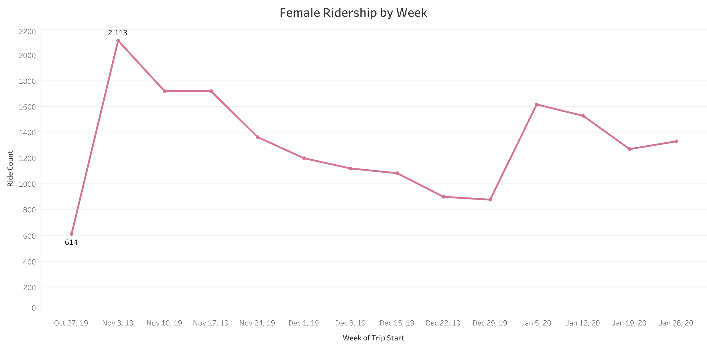
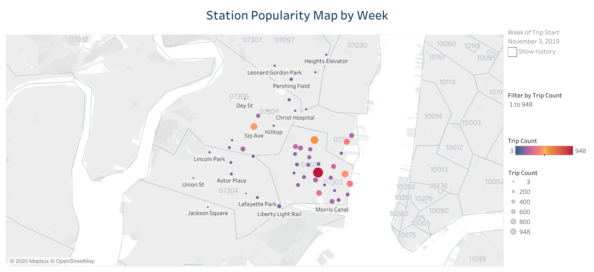
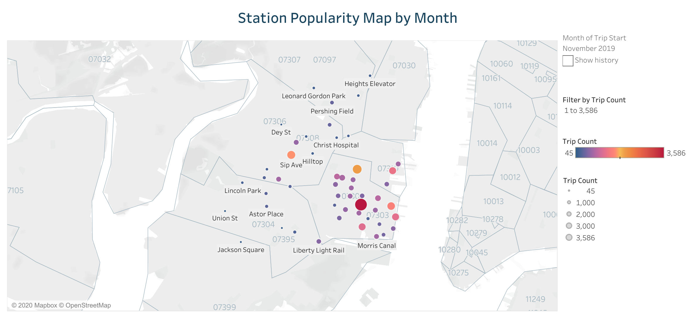

# Citi Bike Analysis from November 2019 to January 2020

### Background

These graphs are for the following scenario:

As the new lead analyst for the [New York Citi Bike](https://en.wikipedia.org/wiki/Citi_Bike) Program, you are now responsible for overseeing the largest bike sharing program in the United States. In your new role, you will be expected to generate regular reports for city officials looking to publicize and improve the city program.

Since 2013, the Citi Bike Program has implemented a robust infrastructure for collecting data on the program's utilization. Through the team's efforts, each month bike data is collected, organized, and made public on the [Citi Bike Data](https://www.citibikenyc.com/system-data) webpage.

However, while the data has been regularly updated, the team has yet to implement a dashboard or sophisticated reporting process. City officials have a number of questions on the program, so your first task on the job is to build a set of data reports to provide the answers.

### Steps

1. Aggregate the data found in the Citi Bike Trip History Logs and find two unexpected phenomena. Design visualizations for each phenomena.
2. Use the visualizations to design a dashboard for each phenomena.
3. Create a dynamic map that shows how each station's popularity changes over time (by month and year) with zip code data overlaid on the map.
4. Create a Tableau story that brings together the visualizations, maps, and dashboards.

### **Ridership Growth**

Over the selected period from November 2019 to January 2020, there have been a total of 76,545 trips. The maximum number of trips taken during this period occurs during the week of November 3, 2019, with 8,284 trips that week. This is a 233% increase from the start of the selected period, November 1, 2019. After that, the total number of trips steadily decreases until January 2020, when the total number of trips then rises to 6,613 during the week of January 5, 2020. The percentage of total ridership increase (compared to November 1st) decreases from 233% to only 60.6% for the week December 29th. For the rest of January 2020, the total number of trips decreases slightly to 5,223 for January 19, and then increases slightly to 5,586 trips taken the last week of January. Thus, the most popular weeks to ride are from November 3rd to November 17th, and the first week of January. December is the least popular month to ride. This may be due to the weather, as the weather in November is higher than the weather in December. Although January is still cold compared to December, the increase in rides could be due to New Year’s Resolutions since people may have resolutions to increase their activity.

### **Top and Bottom Stations - Start and End of Journey**

Grove St PATH, Sip Ave, Hamilton Park, Harborside, Colombus Dr at Exchange Pl, Marin Light Rail, Newport PATH, Warren St, and City Hall are the most popular stations to both start and end a journey. Thus, perhaps the most popular stations, both to start and end a journey, are located in major centers or near work places, and thus is more convenient to start and end a trip there. There is no overlap between the least popular stations to start a journey and to end a journey. However, the lowest count of trips to start a journey for all stations is Communipaw & Berry Lane, with 264 trips started at that station for the three months studied. The bottom ten lowest count of trips to end a journey for all stations is less than 11, with the bottom nine lowest count of trips to end a journey for all stations is less than 4. Thus, only one person ended their journey at those stations, which does not provide much insight into the overall popularity of ending a journey at those stations. Due to limitations of uploading data to Tableau Public, a larger time frame must be studied to draw conclusions regarding the least popular stations to end a journey. Thus, perhaps the most popular stations, both to start and end a journey, are located in major centers or near work places, and thus is more convenient to start and end a trip there.

### **User Type Analysis**

The proportion of user types (Customer or Subscriber) does not change significantly over the weeks studied. However, the number of subscribers significantly increases during first week of November, and steadily decreases until the first week of January, when it increases again. This may be due to similar reasons as total ridership changes. More riders may become subscribers when the weather is better and after starting the new year with a fitness resolution. 

The peak hour to ride for subscribers happens at 8:00 AM.  People may ride the Citi Bike to work, which is usually around 8 - 9 AM. The trip count for subscribers then decreases after 8:00 AM, and increases again around 4:00 PM, with the second most popular time to ride occuring between 5:00 PM - 6:00 PM. This is likely due to the fact that people may ride home from work, which is usually around 5 - 6 PM. Between 8:00 AM and 5:00 PM, the number of rides for subscribers is steadily around 3,000 rides per hour. 

20 year olds have the highest average trip duration. 58 year olds, 43 year olds, and 60 year olds have the second, third, and forth highest average trip duration respectivelty. Many records had a birth year of 1888, which was excluded from the dataset. The highest average trip durations occur with customers compared to subscribers. Since the trip count is higher overall for subscribers compared to customers, this may be due to the fact that subscribers take many, short trips whereas non-subscriber customers take few, long trips.

### **Female Ridership Analysis**

##### Male vs Female Active Participant Breakdown

Over the three months examined, males account for more than half of all trips taken. 36,952 trips were taken by females, whereas 54,606 trips were taken by males. Undefined accounted for 3,463 trips, which are people who either did not specify their gender or do not identify with a gender.

##### Average Trip Duration by Age of Male vs Female

Males' and females' average trip duration shows interesting results. 20 year old males have the highest average trip duration, whereas 42 year old females have the highest average trip duration. The 42 year old females have a higher average trip duration (at 12,852 seconds) than the 20 year old males (at 9,780 seconds). The male average trip duration shows that the average trip duration is consistant with the majority of ages, but is higher for males of age 20, 30, 43, 58, 67, and 82. The female average trip duration is much more consistant, with the large spike for 42 year olds, and relatively higher for females of age 20, 21, and 27.

##### Female Ridership by Week

Female Ridership increases similar to total ridership-- increasing the first week of November, decreasing during December, and spiking back up the first week of January.

### **Station Popularity**

##### Station Popularity by Week

The popularity of stations for the start of a trip by week of the selected period is similar to the above conclusions. More trips are taken at the popular stations (listed above) during the first weeks of November and the first week of January. The most popular stations have a lower trip count during the month of December for all weeks.

##### Station Popularity by Month

The popularity of stations for the start of a trip is highest in November, second highest in January, and lowest in December. There are also more stations with a higher trip count in November and January than there are in December. The stations with the highest trip count stays the same for all three months.

